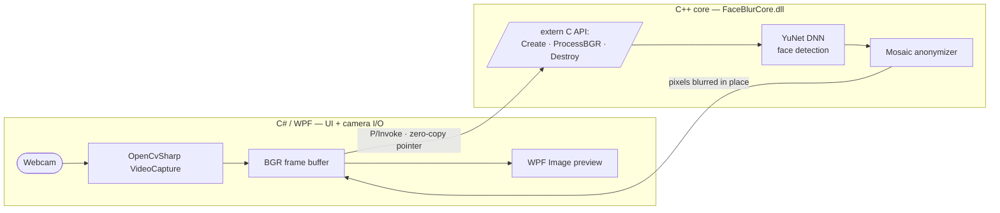

# Face Blur — On-Premise

Real-time face anonymization that runs **entirely on the local machine**. No frame
ever leaves the device — face **detection** and **blurring** happen locally, in line
with **GDPR / Datenschutz** requirements for handling personal data in camera footage.

It is a small but complete version of a privacy-first security-camera feature, built
with the stack such products use: a **C++ / OpenCV** vision core for performance and a
**C# / WPF** desktop UI, bridged with **P/Invoke**.

> 🔒 **On-Premise · No network access** — the app makes zero outbound calls and ships
> its detection model embedded; nothing is downloaded or uploaded at runtime.

## Demo


_Faces are blurred in real time; the **Detection** toggle and the **Blur** slider are
live. [▶ Watch the full clip (MP4)](docs/demo.mp4)._

## Why this design

Two languages, each doing what it is best at:

| Layer | Tech | Responsibility |
| ----- | ---- | -------------- |
| **Vision core** | C++ + OpenCV | The performance-critical work: DNN face detection + per-pixel mosaic, compiled to a reusable DLL |
| **UI** | C# + WPF | A responsive desktop window, camera I/O, and live controls |
| **Bridge** | P/Invoke | A thin, flat C API connects the two with **zero-copy** frame passing |

The split is deliberate: heavy pixel work belongs in native code, while a rich,
event-driven UI is far easier in C#/WPF. The **on-premise** principle is the heart of
the project — faces are personal data, so they are never sent anywhere.

## Architecture



**Per-frame pipeline**

1. C# grabs a webcam frame with OpenCvSharp (`Mat`, BGR pixels).
2. The frame's **pixel buffer pointer** is handed to the C++ DLL via P/Invoke — no copy.
3. C++ wraps that memory in a `cv::Mat`, detects faces (YuNet DNN), and pixelates each
   face **in place**.
4. Because it is the same memory, C# already has the anonymized frame and displays it.

The native vision logic is wrapped in SOLID C++ classes (`IFaceDetector` abstraction,
`HaarFaceDetector` / `DnnFaceDetector` implementations, `FaceAnonymizer`), kept behind a
minimal C API so the boundary stays language-agnostic.

## Tech stack

- **C++17**, **OpenCV 4.11** (DNN module, `cv::FaceDetectorYN`)
- **YuNet** ONNX face-detection model (pre-trained, runs locally)
- **C# / .NET 10**, **WPF**, **OpenCvSharp4**
- **P/Invoke** (`[DllImport]`) bridge, **CMake** + **MSBuild** builds

## Face detection: Haar → DNN

The project supports two detectors behind one interface, which made a direct comparison
easy. Notes from building both:

| | Haar Cascade | YuNet (DNN) |
| --- | --- | --- |
| Frontal faces | Good | Good |
| Side profiles / tilt | Often missed | Reliable |
| Poor lighting | Struggles | Robust |
| False positives | More | Fewer |
| Tuning | Few knobs | Confidence threshold |
| Cost | Very cheap | Heavier (still real-time) |

**Decisions made along the way**

- **Recall over precision.** For an anonymizer, a *missed* face is a privacy leak, while
  an over-blurred non-face is merely cosmetic. The DNN confidence threshold was lowered
  from `0.9` to `0.6` so borderline faces are still blurred.
- **Measure in Release.** The DNN ran ~10 FPS in a Debug build (which links the debug
  OpenCV) but **20–30 FPS in Release** — the heavy work lives inside OpenCV, so Debug
  numbers are misleading.
- **Detect on a downscaled frame.** Detection cost scales with pixel count; running it on
  a half-size copy and scaling boxes back up turned ~6 FPS into ~20 FPS for Haar.

## Project structure

```
face-blur-onpremise/
├── src/                      C++ vision core
│   ├── IFaceDetector.h         detection interface (abstraction)
│   ├── HaarFaceDetector.*      Haar implementation
│   ├── DnnFaceDetector.*       YuNet DNN implementation
│   ├── FaceAnonymizer.*        detect + mosaic core
│   ├── FaceBlurApi.*           flat C API (the DLL boundary)
│   └── main.cpp                console test app (switch Haar/DNN)
├── tests/smoke_test.cpp      drives the DLL via its C API only
├── models/                   embedded YuNet ONNX model
├── FaceBlurApp/              C# / WPF application
│   ├── FaceBlurEngine.cs       P/Invoke wrapper (IDisposable)
│   └── MainWindow.xaml(.cs)    UI + capture loop
└── CMakeLists.txt            builds the DLL + console app + smoke test
```

## Build & run

**Prerequisites** (Windows x64)

- Visual Studio 2022+ with **Desktop development with C++** and **.NET desktop
  development** workloads
- **CMake** (bundled with Visual Studio or standalone)
- **OpenCV 4.11.0** prebuilt pack extracted to `C:\opencv`
  (CMake expects `C:/opencv/build/x64/vc16/lib`)
- **.NET 10 SDK**

**1. Build the C++ core (DLL)**

```powershell
cmake -S . -B build -A x64
cmake --build build --config Release
```

This produces `build/Release/FaceBlurCore.dll` (plus `FaceBlur.exe`, a console test app,
and `SmokeTest.exe`).

**2. Run the C# app**

```powershell
dotnet run --project FaceBlurApp -c Release
```

The C# project automatically copies `FaceBlurCore.dll`, `opencv_world4110.dll`, and the
model next to its executable, so build the C++ Release first. Click **Start Camera**,
then try the **Detection** toggle and the **Blur** slider.

## Privacy / on-premise

- No outbound network calls anywhere in the code (verified — no `HttpClient`,
  `WebClient`, or sockets).
- The detection model is committed under `models/` and shipped with the app — nothing is
  downloaded at runtime.
- A visible **On-Premise · No network access** badge makes the guarantee explicit in the
  UI. The app runs fully with the network disabled.

## License

[MIT](LICENSE) © Özal Akdeniz
